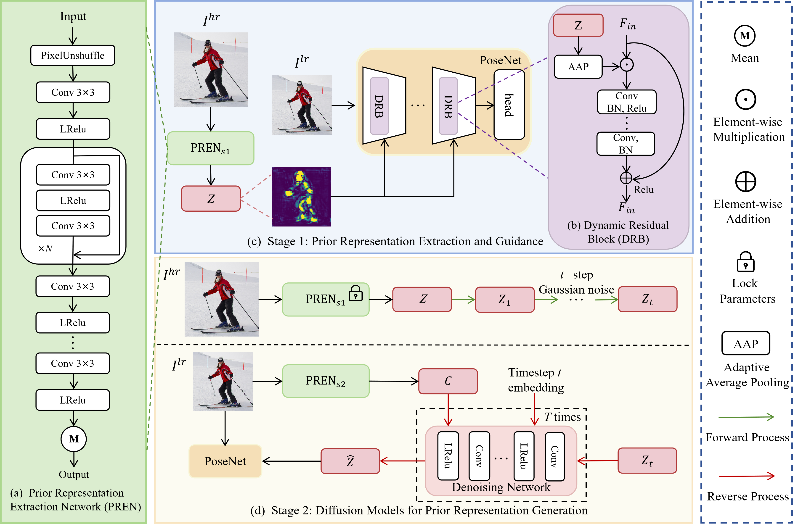

# A Prior Representation-Guided Method for Low-Resolution Human Pose Estimation (ICMR 2025)

This repository is the official implementation of the paper: **"A Prior Representation-Guided Method for Low-Resolution Human Pose Estimation"**, accepted by **ICMR 2025**.

---

## 📖 Abstract

Human pose estimation (HPE) has achieved significant progress on high-resolution (HR) images, but it experiences severe performance degradation on low-resolution (LR) images. One key reason is that LR images lack sufficient appearance details and fine-grained spatial information. 

In this paper, we propose a Prior Representation-Guided method (PRG) for low-resolution human pose estimation. Our approach consists of two stages:
* **Stage 1:** We design a prior representation extraction network to obtain prior knowledge from HR images. We then propose Dynamic Residual Blocks that utilize the extracted prior representation to guide the pose estimation network, focusing on detailed features around joint areas. 
* **Stage 2:** We utilize a compact diffusion model with fewer iterations to generate consistent prior representations directly from LR images, effectively eliminating the reliance on HR images during inference.

Extensive experiments demonstrate that our method achieves significant improvements across various resolutions and backbone networks. Notably, our method improves 16.4 AP compared to the SimCC-Res50 baseline at a resolution of $32 \times 32$.

---

## 🏗️ Framework Overview


> *Note: Please upload your framework image to the `assets` folder and ensure the path above is correct.*

---

## 🛠️ Installation

This project is built upon [MMPose](https://github.com/open-mmlab/mmpose).

Please refer to the [MMPose Installation Guide](https://mmpose.readthedocs.io/en/latest/installation.html) for detailed environment setup and dataset preparation.

---

## 🚀 Training and Testing

The training process follows a two-stage pipeline: **Prior Extraction** and **PRG Refinement**.

### 1. Training - Stage 1 
Train the first-stage model to obtain the prior representation from HR images:
```bash
python tools/train.py configs/Dynamic/coco/Prior_stage1_simcc_hrnet_w32-1xb64_210e_coco_32x32.py

After training, you will obtain a checkpoint file (e.g., best_coco_AP_epoch_210.pth).

### 2. Training - Stage 2 
Before starting Stage 2, you must manually update the configuration file to link the Stage 1 checkpoint. 

Modify the `s1_pretrained` path in `configs/Dynamic/coco/Prior_stage2_simcc_hrnet_w32-1xb64_210e_coco_32x32.py`:

```python
# In your Stage 2 config file:
s1_pretrained = '/path/to/your/work_dirs/e.g., best_coco_AP_epoch_210.pth'

Then, execute the Stage 2 training:

```bash
python tools/train.py configs/Dynamic/coco/Prior_stage2_simcc_hrnet_w32-1xb64_210e_coco_32x32.py

### 3. Testing
Once Stage 2 is finished, evaluate the final model:

```bash
python tools/test.py \
    configs/Dynamic/coco/Prior_stage2_simcc_hrnet_w32-1xb64_210e_coco_32x32.py \
    work_dirs/path/to/your/final_model.pth
